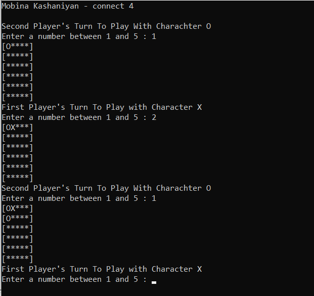
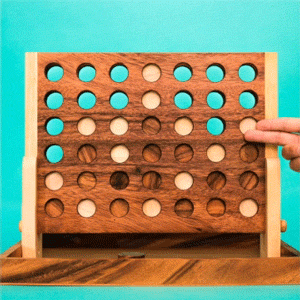

# Connect Four  

Connect Four is a two-player game.In this game, the first player picks a number between 1 and 5, and the board will be filled with either a X character or an O character that assigned randomly to each player at the beginning of the game.The objective of the game is to be the first person who can form a horizontal, vertical, or diagonal line of four one's own character.

## Language

The game is written in C++.

## Image

</img> 

</img> 

## Contributing
Pull requests are welcome. For major changes, please open an issue first to discuss what you would like to change.

Please make sure to update tests as appropriate.
